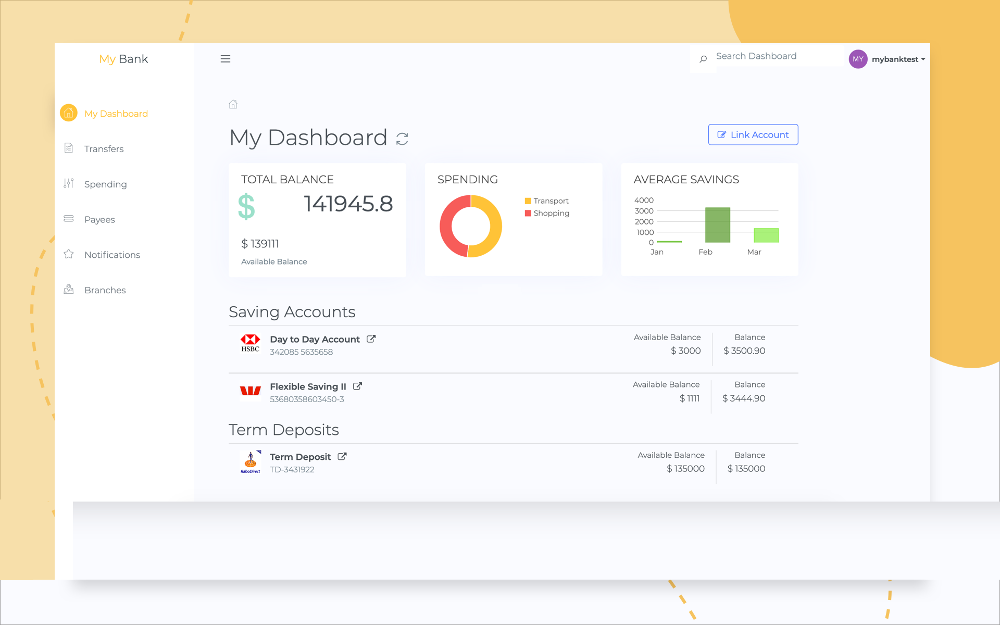
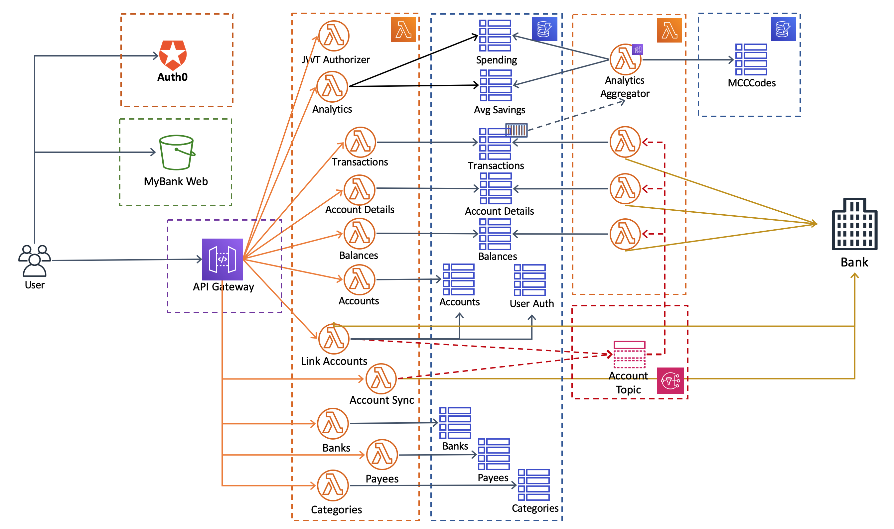

# MyBank Account Aggregator

Third Party Provider or TPP allows to securely access customer’s accounts in order to provide consolidated account information. It aggregates accounts from different banks owned by the customer to manage and control them from one central place. 

It also provides analytics to help you stay on track with your spending in just one place. MyBank categories every transaction making it easier to see how your spending affects your planned savings.

Auth0 provides user management and authentication using OpenId Connect Authorization Code Flow. The flow provides information about the end user in the form of an id_token (JSON Web Tokens - JWTs) that verifies the identity of the user and provides basic profile information about the user. 

Preview: http://www.mybank.com.ar.s3-website-ap-southeast-2.amazonaws.com



## Application architecture

The application is divided into frontend and backend. The frontend is written in Vue.js. Backend is implemented using serverless. Each component of the application is defined as a function and exposed as an API. There are also notification which are consumed by specific functions. The information is stored in AWS DynamoDB.



The application architecture is divided in the following components:

### Static Web Hosting
Amazon S3 hosts static web resources including HTML, CSS, JavaScript, and image files which are loaded in the user's browser.

### Auth0
Auth0 provides user management and authentication functions to secure the backend API.

### RESTful API
The front-end application uses Vue.js to interact with backend API built using Lambda and API Gateway. Asynchronous execution is implemented using Amazon Simple Notification Service.

### Persistent Store
DynamoDB provides a persistence layer where data is stored and accessible using Lambda function.

## Instalation 

1. Clone repository
```shell
git clone https://github.com/jmiddleton/mybank-poc.git
git clone https://github.com/jmiddleton/mybank-serverless.git
```
2. Get in the project folder
```shell
cd mybank-poc
```
3. Install dependencies via npm
```shell
npm install
```
4. Repeat the steps for mybank-serverless

## Quick start - development mode
First start mybank-serverless application
```shell
cd mybank-serverless
serverless offline start
```
Once the server has started an api-key will be generated and displayed in the command line:
i.e.: Key with token: d41d8cd98f00b204e9800998ecf812345

Copy that value to .env.development file before starting mybank-poc web application.

To test the application locally use the following commands: 
```shell
cd mybank-poc
npm run serve
```

### Production mode
The easiest way to preview production locally is using a Node.js static file server.

```
npm run build
serve -s dist -l 8888
```

Please make sure you have configured your environment for production. Create a file in the root folder with the name ```.env.production.local``` and add the following variables:

- VUE_APP_BASE_URL=http://[YOUR_AWS_LAMBDA_ENDPOINT]:[YOUR_AWS_LAMBDA_PORT]/mybank/v1
- VUE_APP_API_KEY=[YOUR_AWS_LAMBDA_API_KEY]

### Deploy static website to AWS S3
To deploy the static website to AWS S3, just execute:

```
npm run build
npm run deploy
```

To configure a AWS S3 Bucket as static website, check the following blog for more details:

https://medium.com/@serverlessguru/deploy-reactjs-app-with-s3-static-hosting-f640cb49d7e6

### Test data

Locally run the following json server

```
cd mybank-poc
json-server --watch data/sample-api-data.json --routes data/routes.json --id accountId --port 4000
```